# Heroku Deployment

This document outlines the steps necessary for the installation and setup of a new Metecho instance in Heroku. Thanks to Claudio Moraes for developing this setup guide.

Before you start, ensure you are familiar with Heroku, personal vs enterprise account, private spaces, security guidelines, pipeline, Heroku drains, and all related Heroku functionality.

## Requirements

* Heroku Enterprise Account
* [Heroku CLI](https://devcenter.heroku.com/articles/heroku-cli)
* GitHub Account
* Your repository must be set up as a CumulusCI project and hosted on [github.com](http://github.com/).

## Pre-Deployment

### Create a Private Space on Heroku (Optional)

If you don’t already have a private space to use, create a [Private Space](https://devcenter.heroku.com/articles/private-spaces) to contain the Metecho app. (This ensures that communication between the app and its datastores is on a private network.)

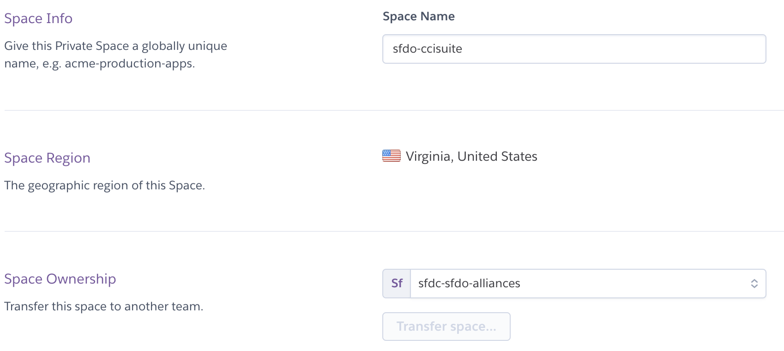

It will take a few minutes for the Private Space creation process to complete.

### Create Metecho App

Create an app in the Private Space where you will deploy Metecho. If you're not using a Private Space, create the app in your preferred Heroku account or team.


### Buildpack Configuration

Navigate to the Settings tab and add the following Buildpacks, in this order:

* `heroku/nodejs`
* `https://github.com/SalesforceFoundation/simple-salesforce-dx-buildpack.git`
* `heroku/python`

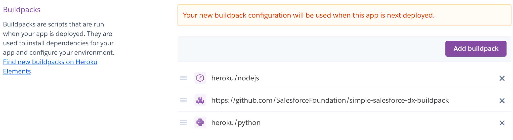

### Data Addons Configuration

Navigate to the Resources tab and add and configure the following Data addons:

* Heroku Postgres - Private 0 plan, Postgres will be inside the private space
* Heroku Redis - Private 7 plan, Redis will be inside the private space. Set [Redis addon's timeout to 0](https://devcenter.heroku.com/articles/heroku-redis#timeout).
* Mailgun

If you are not using a Private Space, you may be able to use smaller and less expensive Heroku data resources.

You should see a screen similar to the following after adding the addons:

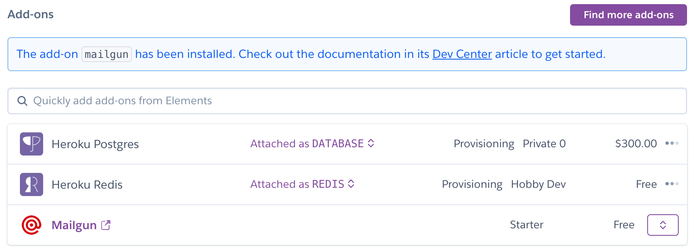

After provisioning finishes,[set the timeout to 0](https://devcenter.heroku.com/articles/heroku-redis#timeout) using the Heroku CLI command line:

```
heroku redis:timeout --app yourmetechoapp —seconds 0
```

Ensure you are first logged in to Heroku CLI - replace ‘yourmetechoapp’ with the name of your Heroku app.

Here is an example of what the command line would look like (APPNAME and REDIS would be specific to your deployment):

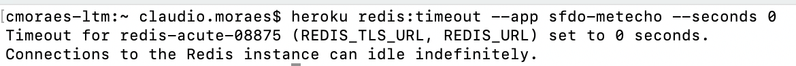

### Create a new GitHub App

Metecho uses a [GitHub app](https://docs.github.com/en/developers/apps/creating-a-github-app) to interact with the GitHub API.

Create a GitHub app to represent this instance of Metecho with the following configuration. Replace `yourmetechoapp` with the name of your Heroku app.

* GitHub App name: Choose its name
* Homepage URL: `https://yourmetechoapp.herokuapp.com/`
* Callback URL: Should be like `https://yourmetechoapp.herokuapp.com/accounts/github/login/callback/`but replace the domain with your app’s domain
* Select “**Request user authorization (OAuth) during installation**”
* Webhook URL: `https://yourmetechoapp.herokuapp.com/api/hook/` but replace the domain with your app’s domain.
* Webhook secret. See [Securing your webhooks](https://docs.github.com/en/developers/webhooks-and-events/securing-your-webhooks) for additional information on how to set a secret token. `ruby -rsecurerandom -e 'puts SecureRandom.hex(20)'`

Configure the following permissions on your GitHub app:

* Repository permissions:
    * Administration: read & write. This permission is used to create repositories and teams.
    * Contents: read & write. This permission is used to create commits.
    * Metadata: read-only
    * Pull requests: read & write. This permission is used to create and comment on Pull Requests.
    * Commit statuses: read & write. This permission is used to reflect build statuses.
* Organization permissions:
    * Members: read & write. This permission is used to manage teams.
* User permissions:
    * Email addresses: read-only. This permission is used to email users who are assigned to tasks.
* Subscribe to events:
    * Pull request
    * Pull request review
    * Push


Click on Create GitHub App.

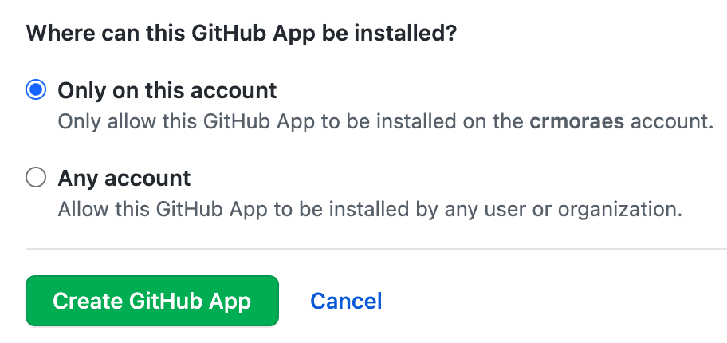

You should see the following message at the top


Click on the "generate a private key" link on the message or scroll down until you see the "Generate a private key" button and then click on it. Make sure you store the generated private key as you will need next.

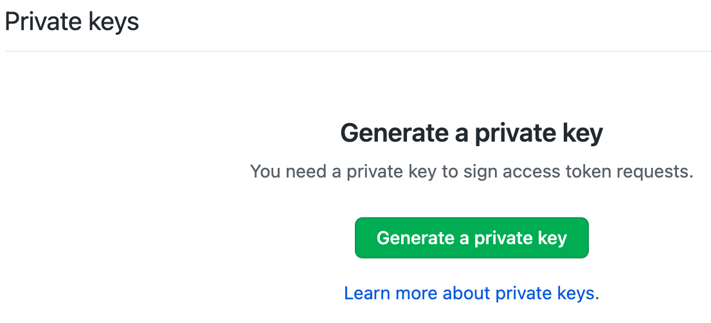

### Salesforce Dev Hub Org

In order to create scratch orgs you’ll need a Salesforce org with the Dev Hub feature enabled. If you wish to use use a minimal permission model with Metecho, which we recommend, configure your Dev Hub as follows.

- Add a new Profile named Metecho by cloning the Minimum Access profile. Configure as follows:
  - Enable CRUD permissions for the Scratch Org Info, Active Scratch Org, and Namespace Registry objects
  - Enable the View Setup and Configuration permission. Metecho needs this in order to check how much scratch org capacity is remaining.
  - Add Login IP Ranges to only allow logins from the *Space Outbound IPs* for your Heroku private space

Add a new User using this profile.

### Create a new Salesforce Connected App

Metecho uses a Salesforce Connected app to authenticate to a Dev Hub org and scratch orgs using OAuth2. We suggest creating this Connected App in a Salesforce org owned by your team.

In Setup, go to App Manager and click the New Connected App button. Configure as follows:

* *Enable OAuth Settings:* Checked.
* *Callback URL*: `https://yourmetechoapp.herokuapp.com/accounts/salesforce/login/callback/` (replace `yourmetechoapp` with the app’s actual domain)
* *Use digital signatures:* Create a private key and certificate, then upload the certificate here. `openssl req -newkey rsa:2048 -nodes -keyout private_key.pem -x509 -days 365 -out certificate.pem`

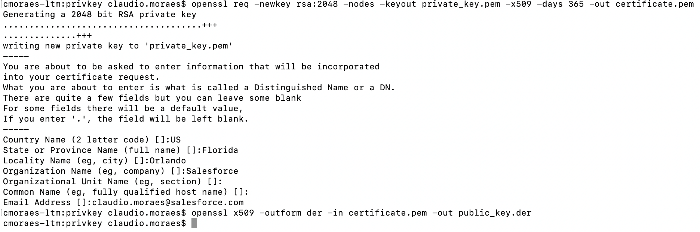

* *Selected OAuth Scopes:*
    * Full access (full)
    * Perform requests on your behalf at any time (refresh_token, offline_access)
    * Provide access to your data via the Web (web)
* Save your Connected App

After saving:

* Click the Manage button
* Click the Edit Policies
* Set *Permitted Users* to “Admin approved users are pre-authorized” and save

In the Profiles related list:

* Click the Manage Profiles button
* Select the Metecho profile for pre-authorized users and save

This will ensure that only users with that profile can log in using this Connected App.

## Deployment

### Heroku Config Vars

Set the following Django config vars for the Heroku app:

* `ADMIN_API_ALLOWED_SUBNETS`: `0.0.0.0/0`
    * **NOTE: **If the private space already has Trusted IP Ranges specified, you can set ADMIN_API_ALLOWED_SUBNETS to 0.0.0.0/0
* `DB_ENCRYPTION_KEY`: Run `python -c 'from cryptography.fernet import Fernet; print(Fernet.generate_key().decode())'` to generate a key for this.
* `DEFAULT_FROM_EMAIL`: `no-reply@yourmetechoapp.org` (replace with your actual domain)
* `DJANGO_ADMIN_URL`: an arbitrary URL slug at which you will access the Django Admin UI.
    * By default, admin users can access Django admin UI at `/admin`. It is recommended that you define a different path to limit discoverability.
* `DJANGO_ALLOWED_HOSTS`: `yourmetechoapp.herokuapp.com` (replace with your actual domain)
    * Determines which domains Django will accept traffic for. Set it to a comma-separated list of the domains that can be used to access the app
* `DJANGO_SECRET_KEY`: Used for signing session cookies. Set this to an arbitrary string. `ruby -rsecurerandom -e 'puts SecureRandom.hex(20)'`
* `DJANGO_HASHID_SALT`: Used for hashing record ids for use in the API. Set this to an arbitrary string.
* `DJANGO_SETTINGS_MODULE`: `config.settings.production`

Set the following GitHub config vars for the Heroku app:

* `GITHUB_APP_ID`: *App ID* for the GitHub app - On the GitHub App > General option > you should find the App ID
* `GITHUB_APP_KEY`: Private key for the GitHub app - this is the private key that you generated earlier.
* `GITHUB_CLIENT_ID`: *Client ID* for the GitHub app - On the GitHub App > General option > you should find the Client ID
* `GITHUB_CLIENT_SECRET`: *Client secret* for the GitHub app - On the GitHub App > General option > you should see your Client secrets or be able to generate a new client secret
* `GITHUB_HOOK_SECRET`: *Webhook secret* for the GitHub app - This is the same Webhook secret that you generated and used when creating your GitHub app

Set the following Salesforce config vars for the Heroku app:

* `SF_CALLBACK_URL`: `https://yourmetechoapp.herokuapp.com/accounts/salesforce/login/callback/`. This is the same value that was entered for *Callback URL* when creating the Connected App.
* `SF_CLIENT_ID`: *Consumer Key* from the Connected App
* `SF_CLIENT_KEY`: Private key that was used to sign the certificate for the Connected App
* `SF_CLIENT_SECRET`: *Consumer Secret* from the Connected App

### Deploy Metecho

Follow these steps to deploy the Metecho code into your Heroku environment.

Clone the project:

```
$ git clone https://github.com/SFDO-Tooling/Metecho.git
$ cd Metecho
```

Add the Heroku remote:

```
$ heroku git:remote -a yourmetechoapp
```

Deploy the local project to Heroku:

```
$ git add .
$ git commit -am "Initial set up"
$ git push heroku main
```


### Setup

On the app’s Heroku Resources tab, scale your dynos:

* `web` dyno: at least 1
* `worker` dyno: at least 1
* `worker-short` dyno: exactly 1

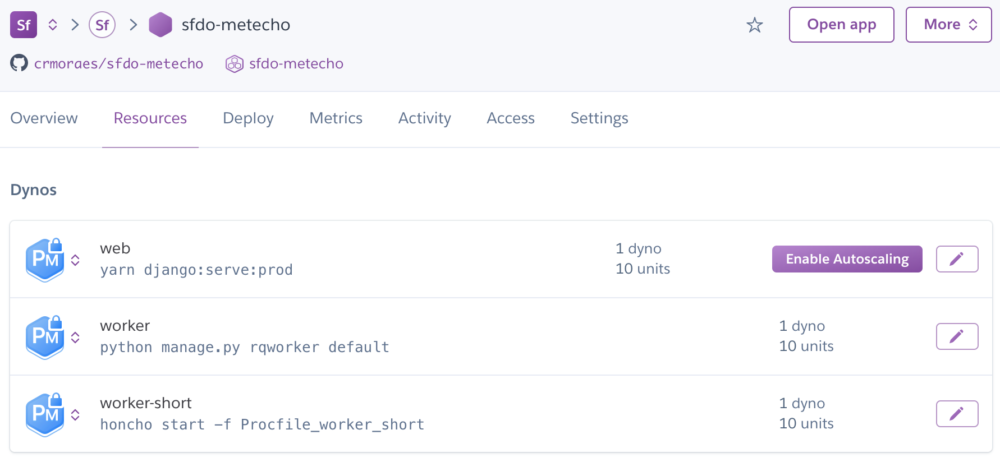

### Admin User Configuration

Go to the app and use the Log In button to log in using a GitHub user.

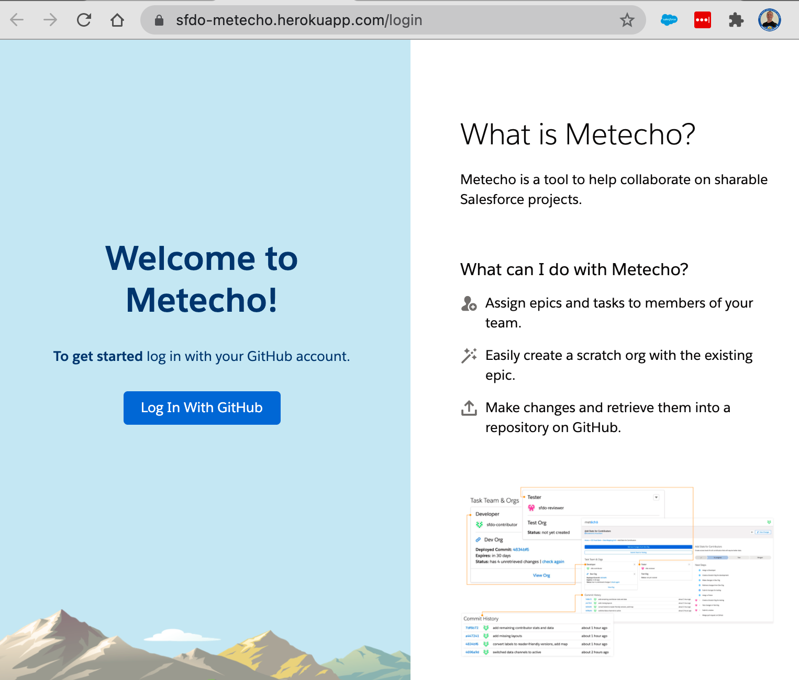

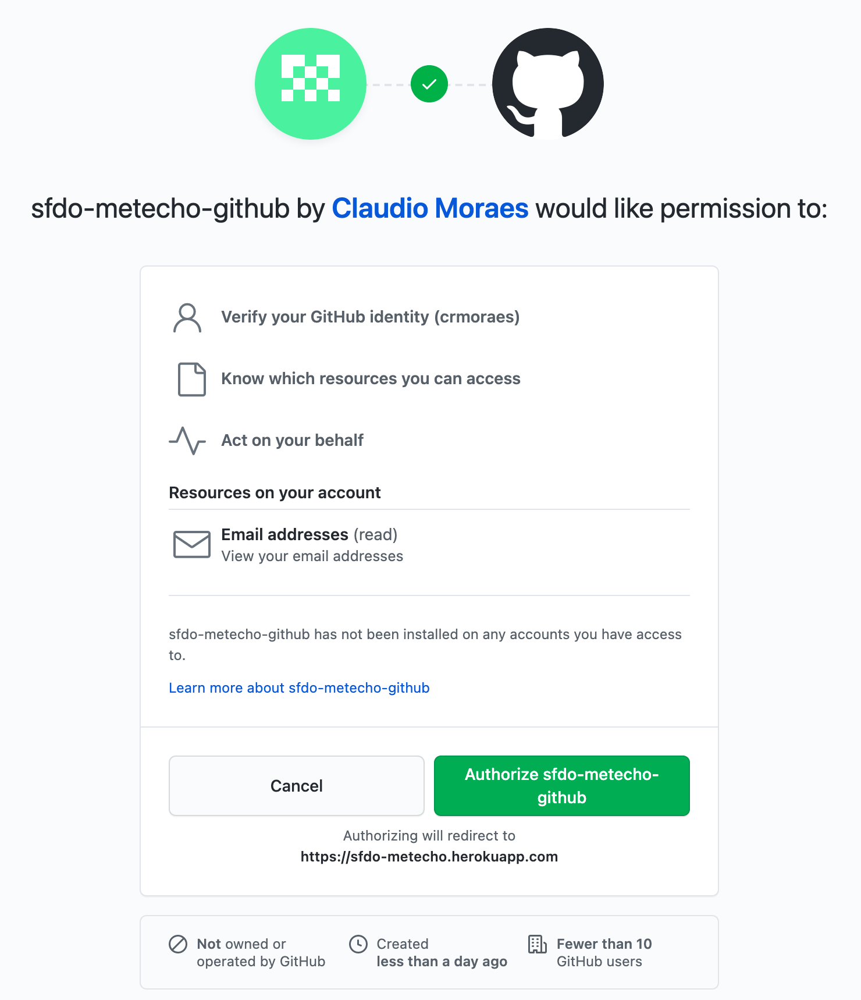

To turn this user into a superuser, run:

```
heroku run ./manage.py promote_superuser USERNAME -a APPNAME
```

(Replace **USERNAME** with the GitHub username you used to log in, and **APPNAME** with the app name.)

### Set up a Metecho project

Go to the admin UI (`/admin` by default, or the value you set in `DJANGO_ADMIN_URL`) and add a Project (which is actually pointing to your GitHub repository).

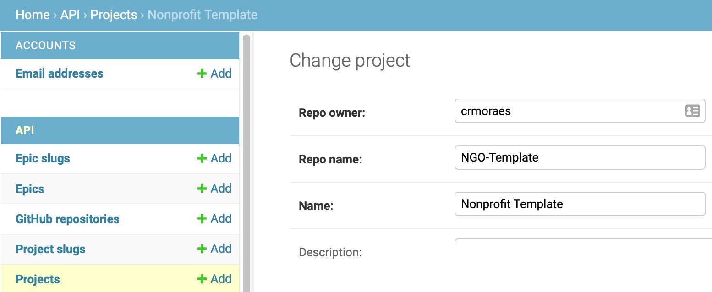

When you create a new Project, a new Project Slug associated to your new Project is also automatically created.

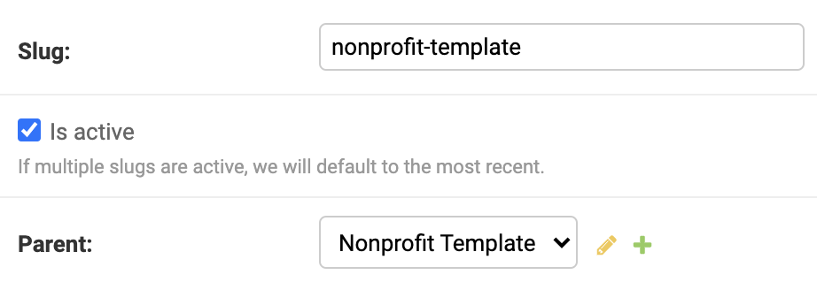

You should now be able to work on this Project in the Metecho UI.

### Metecho - Optional Settings

#### Scratch Org Creation

To make all users share a single Dev Hub for creating scratch Orgs, set the DEVHUB_USERNAME config var to the Salesforce username of a Dev Hub user who has approved the Connected App created above. If you don’t do this, each user will need to connect their own Dev Hub through the UI.

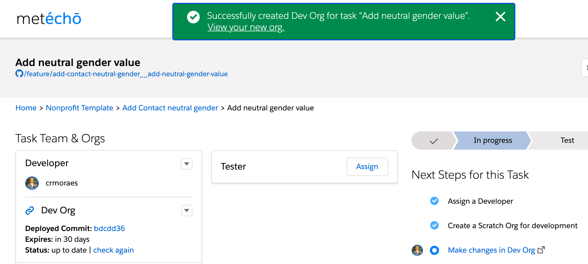

#### Git Branch Prefix

If you’d like Git branches created by Metecho to use a common prefix instead of the feature branch prefix configured in `cumulusci.yml`, set the `BRANCH_PREFIX` config var. (Example: set it to `metecho/` to create branches that start with `metecho/` instead of `feature/`).
